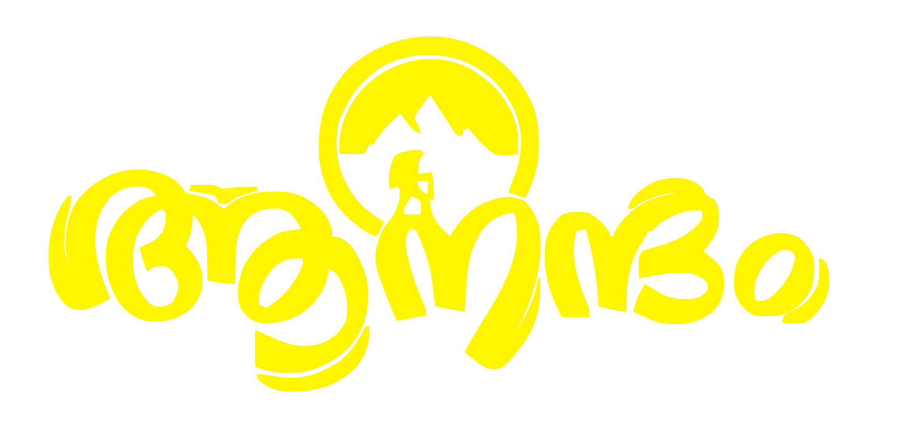

# 🌍 aanandham.go

<div align="center">



### Experience the World, One Stay at a Time

[](https://reactjs.org/)
[](https://vitejs.dev/)
[](https://nodejs.org/)
[](https://expressjs.com/)
[](https://www.mongodb.com/)
[](https://tailwindcss.com/)

</div>

---

## 📖 About The Project

**aanandham.go** is a premium travel booking platform designed to provide seamless experiences for travelers worldwide. Whether you're looking for a cozy cabin, a luxury villa, or a unique cultural experience, aanandham.go connects you with the perfect stay.

Built with a modern tech stack, it features a responsive design, real-time availability, and an intuitive user interface.

## ✨ Key Features

*   **🏠 Diverse Listings:** Explore a wide range of accommodations from beach houses to mountain retreats.
*   **🗺️ Interactive Map:** Visualize listings on a dynamic map to find the perfect location.
*   **🔍 Smart Search:** Filter by category, price, amenities, and more to find exactly what you need.
*   **📅 Seamless Booking:** Easy-to-use booking system with date selection and guest management.
*   **👤 User Profiles:** Manage your bookings, wishlists, and account settings.
*   **👑 Admin Dashboard:** Comprehensive admin panel for managing listings, users, and bookings.
*   **📱 Responsive Design:** optimized for all devices, ensuring a great experience on mobile, tablet, and desktop.

## 🛠️ Tech Stack

### Frontend
*   **React:** For building a dynamic and interactive user interface.
*   **Vite:** For fast development and optimized production builds.
*   **Tailwind CSS:** For rapid and custom styling.
*   **Framer Motion:** For smooth animations and transitions.
*   **React Router:** For seamless client-side navigation.

### Backend
*   **Node.js & Express:** For a robust and scalable server-side architecture.
*   **MongoDB & Mongoose:** For flexible and efficient data storage.
*   **JWT (JSON Web Tokens):** For secure user authentication.

## 🚀 Getting Started

Follow these steps to get a local copy up and running.

### Prerequisites

*   Node.js (v14 or higher)
*   MongoDB (Local or Atlas)
*   Git

### Installation

1.  **Clone the repository**
    ```bash
    git clone https://github.com/AmanTShekar/aanandham.go.git
    cd aanandham.go
    ```

2.  **Install Dependencies**

    *   **Frontend:**
        ```bash
        cd client
        npm install
        ```

    *   **Backend:**
        ```bash
        cd ../server
        npm install
        ```

3.  **Environment Setup**

    *   Create a `.env` file in the `server` directory and add your MongoDB connection string and other secrets:
        ```env
        MONGODB_URI=your_mongodb_connection_string
        JWT_SECRET=your_jwt_secret
        PORT=5000
        ```
    *   Create a `.env` file in the `client` directory:
        ```env
        VITE_API_URL=http://localhost:5000/api
        VITE_GOOGLE_MAPS_API_KEY=your_google_maps_api_key
        ```

4.  **Seed the Database (Optional)**
    ```bash
    cd server
    npm run seed
    ```

5.  **Run the Application**

    *   **Start Backend:**
        ```bash
        cd server
        npm run dev
        ```
    *   **Start Frontend:**
        ```bash
        cd client
        npm run dev
        ```

    Open `http://localhost:5173` in your browser to view the app.

## 📂 Project Structure

```
aanandham.go/
├── client/              # React Frontend
│   ├── src/
│   │   ├── assets/      # Images and icons
│   │   ├── components/  # Reusable UI components
│   │   ├── contexts/    # React Contexts (Auth, Preferences)
│   │   ├── pages/       # Application pages
│   │   └── services/    # API integration
│   └── ...
│
└── server/              # Express Backend
    ├── models/          # Mongoose models
    ├── routes/          # API routes
    ├── index.js         # Server entry point
    └── ...
```

## 🤝 Contributing

Contributions are what make the open-source community such an amazing place to learn, inspire, and create. Any contributions you make are **greatly appreciated**.

1.  Fork the Project
2.  Create your Feature Branch (`git checkout -b feature/AmazingFeature`)
3.  Commit your Changes (`git commit -m 'Add some AmazingFeature'`)
4.  Push to the Branch (`git push origin feature/AmazingFeature`)
5.  Open a Pull Request


</div>
